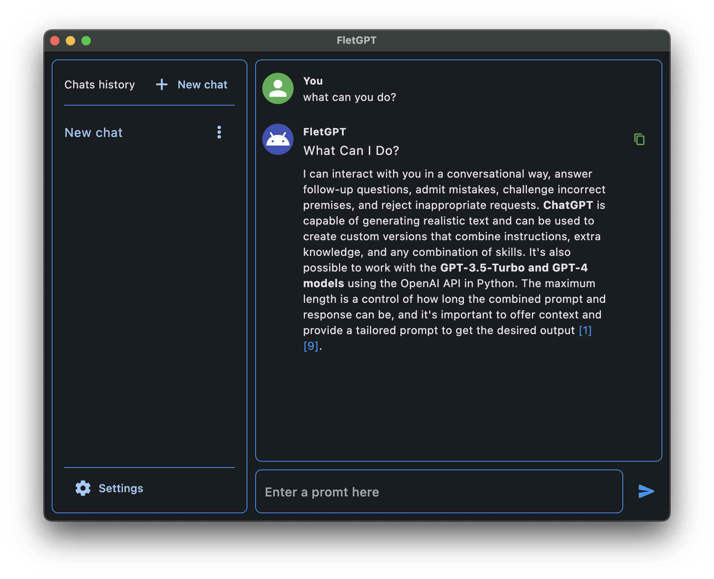

## FletGPT



### Description

FletGPT is an AI-powered chatbot built with the ChatGPT language model. FletGPT can interact with users in a realistic and informative manner, answering their questions, fulfilling their requests, and even creating new creative text.

FletGPT is based on the [gpt4free](https://github.com/xtekky/gpt4free) project, which provides access to the ChatGPT language model. FletGPT uses the [Flet](https://flet.dev)  framework to create the GUI.

### Features

* **User interaction:** FletGPT can carry on conversations with users, answering their questions, fulfilling their requests, and even just chatting.
* **Text generation:** FletGPT can generate various types of text, including poems, code, scripts, musical pieces, emails, letters, and so on.
* **Language translation:** FletGPT can translate text from one language to another.
* **Answering questions:** FletGPT can answer users' questions using its knowledge of the world.

### Target audience

FletGPT is intended for a wide audience, including users who want to learn more about artificial intelligence, as well as users who want to use chatbots for various purposes, such as communication, creativity, and learning.

### Installation instructions

1. **Install Python version 3.10 or higher.**

   You can download Python from the official website [https://www.python.org/downloads/](https://www.python.org/downloads/).

2. **Download the FletGPT repository.**

   You can download the FletGPT repository using the command:

    ```
    git clone [https://github.com/](https://github.com/): [https://github.com/](https://github.com/)[username]/flet-gpt
    ```

3. **Navigate to the directory with the downloaded repository.**

    ```
    cd flet-gpt
    ```

4. **Run FletGPT.**

   To run FletGPT, depending on the operating system, follow these steps:

    * **MacOS/Linux:**

        ```
        ./start.sh
        ```

    * **Windows:**

        ```
        start.bat
        ```
        

**Alternative installation method:**

* **Download the pre-compiled executable file from the release.**

  You can download the pre-compiled executable file from the [Release section](https://github.com/Vabiel/FletGPT/releases) of the FletGPT repository.

  After downloading the file, extract it to the desired location and run it.